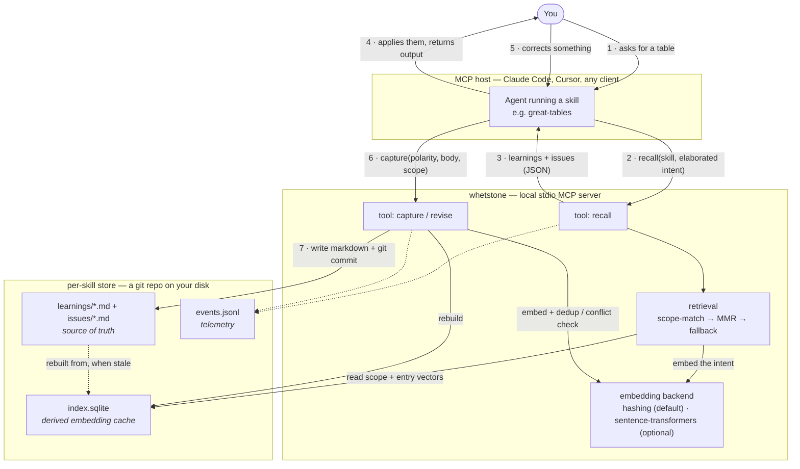
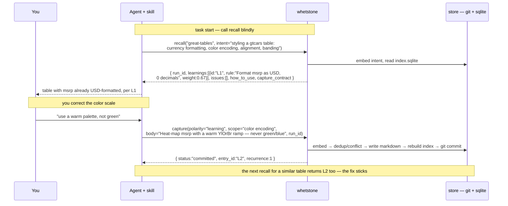

# Whetstone

[](https://github.com/HrudithL/whetstone/actions/workflows/ci.yml)
[](https://pypi.org/project/whetstone-mcp/)
[](https://pypi.org/project/whetstone-mcp/)
[](LICENSE)

**Give any AI skill a memory of your taste — so you stop correcting the same things every session.**

Whetstone is a local [MCP](https://modelcontextprotocol.io) server that lets *any* skill improve
from ordinary use. It attaches to a skill you already use and keeps a git-tracked, per-skill store
of two things:

- **Learnings** — what you *like* (soft, weighted, decaying preferences — "negatives in parentheses",
  "warm palette, not green", "square corners").
- **Issues** — what the skill got *wrong* (hard rules it must never repeat).

At the start of a task it **recalls** the relevant ones and applies them; when you correct the
output, it **captures** the correction so it sticks next time. No benchmark, no dataset, no
fine-tuning — it learns from a *single* correction, immediately, and the whole memory is plain
markdown in a git repo you own.

> A skill is the **architecture** — shared, tested, canonical, the same for everyone. Whetstone is
> the **weights** — everything learned about *your* preferences, layered on at runtime and never
> baked into the skill.

## Why you'd use it

- **Corrections stick.** Tell it once; it's re-applied on every future run of that skill — you never
  re-explain the same preference.
- **Any skill, any MCP host.** It never modifies the skill; it adds a learned layer on top.
- **Transparent and yours.** Every preference is legible markdown, versioned in git — read it, edit
  it, `git revert` it. Nothing leaves your machine.
- **Light.** The base install pulls in only the MCP SDK and uses a deterministic hashing backend (no
  torch, no network); upgrade to embedding-based recall when you want.

---

## Install — from scratch

Requires **Python 3.11+**.

### 1. Install the server

```sh
pipx install whetstone-mcp      # recommended: isolated, puts `whetstone` on your PATH
# or:
pip install whetstone-mcp       # into the current environment
# or, run it without installing:
uvx whetstone-mcp
```

`pipx` / `pip` install two equivalent commands — `whetstone` (primary) and `whetstone-mcp`; `uvx`
runs the server on demand **without** installing anything on your PATH. Either way it's a stdio MCP
server that waits for an MCP client, so you don't run it by hand — a host does.

### 2. Register it with your MCP host

Point your host at the server under the id `whetstone`. For [Claude Code](https://claude.com/claude-code):

```sh
claude mcp add whetstone -- whetstone            # if installed (pipx / pip)
claude mcp add whetstone -- uvx whetstone-mcp    # no install; uv fetches & runs on demand
```

Any other MCP host works too — configure a stdio server whose command matches how you installed it:
`whetstone` (pipx / pip), `uvx whetstone-mcp` (no install), or the venv's `.venv/bin/whetstone`
(from source).

### 3. Use it — the loop

Once registered, a skill (or your agent) uses Whetstone around each task:

1. **`recall`** at the start of a task → Whetstone returns the learnings + issues relevant to what
   you're doing, and the skill applies them.
2. You review the output and **correct** something.
3. **`capture`** turns that correction into a scoped entry — a preference becomes a *learning*, an
   "always/never" becomes an *issue*. Next time, `recall` surfaces it and it's applied automatically.

`attach` scaffolds a skill's store the first time it's used; `revise` lets you reinforce, weaken, or
remove an entry by id.

### Optional: higher-quality recall

The default `hashing` backend is deterministic and dependency-free. For embedding-based retrieval
(better matching of your intent to stored preferences):

```sh
pipx install "whetstone-mcp[embeddings]"           # fresh install, with the extra
pipx inject whetstone-mcp sentence-transformers    # add to an existing pipx install
pip install "whetstone-mcp[embeddings]"            # pip
uvx --from "whetstone-mcp[embeddings]" whetstone   # no-install run, with the extra
```

For the no-install path, register the host with the same `--from` form (e.g.
`claude mcp add whetstone -- uvx --from "whetstone-mcp[embeddings]" whetstone`) so recall/capture
actually have `sentence-transformers` available.

then set `embedding_backend = "sentence-transformers"` in `~/.config/whetstone/config.toml`.

### From source (contributors)

```sh
python3 -m venv .venv
.venv/bin/pip install -e '.[dev]'
.venv/bin/whetstone            # run the server
```

---

## The tools

Whetstone exposes five MCP tools:

- **`attach`** — register a skill so Whetstone tracks its learned layer (scaffolds the store).
- **`recall`** — at task start, retrieve the learnings (weighted preferences) and issues (mandatory
  constraints) relevant to an *elaborated* intent.
- **`capture`** — the moment you act on feedback, distill it into a scoped, deduped entry.
- **`revise`** — reinforce / weaken / remove / promote / demote an entry `recall` showed (by id);
  confirmation-gated.
- **`metrics`** — reporting only: per-skill KPIs drawn from each store's event log.

Some operations are deliberate out-of-band maintenance — periodic or human-initiated, never fired
mid-task by the model — so they are command-line subcommands rather than tools:

```sh
whetstone compact <skill>          # retire stale learnings, merge near-dup scopes; report
                                   #   advisory behavioral findings (harden/stale/churn/conflict)
whetstone compact --all            # compact every skill, then *report* cross-skill preference
                                   #   clusters as advisory candidates (never writes)
whetstone promote <skill> <id>     # lift one learning/issue into the learned global layer by hand
whetstone promote <skill> <id> --cluster  # enact one reported cross-skill candidate, by hand
whetstone export <skill>           # write a shareable preference pack (.tar.gz)
whetstone import <skill> <pack>    # import a pack, dedup-aware (--merge default | --replace)
whetstone doctor <skill>           # read-only health check for the learned loop (never edits)
```

What each of those does:

- **`compact`** — the periodic tidy-up. A **structural** pass (auto-applied) dedupes entries, merges
  overlapping scopes, and retires decayed learnings; a **behavioral mining** pass reads the event log
  and *reports* — advisory only, never auto-applied — learnings worth hardening, scopes with capture
  churn, stale learnings, and unresolved conflicts (printed + written to a git-ignored
  `compact-report.md`). You enact a finding with `revise`.
- **`promote` / `compact --all`** — feed the **learned global layer** below, always by an explicit
  human step: `compact --all` only *detects and reports* a cross-skill candidate (never writes to the
  global store itself — promotion always asks, regardless of supervision mode); `promote <skill> <id>
  --cluster` is how you enact one it reported, and plain `promote <skill> <id>` lifts a single entry
  by hand.
- **`export` / `import`** — **preference packs**: a `.tar.gz` of your `learnings/` + `issues/` markdown
  plus a `pack.toml` manifest (telemetry, the derived index, and git history are excluded). Import is
  dedup- and conflict-aware and **re-mints ids**, so a teammate's pack never collides with yours.
- **`doctor`** — a read-only check that the learn loop is actually wired (are recalls/captures
  landing?); if it looks dead it prints host setup instructions. It never edits your skill or store.

**Learned global layer.** A preference that recurs across skills can live in a reserved `__global__`
store; `recall` runs the same retrieval over it too and unions the (origin-tagged) results, so a
correction taught once applies everywhere. Disable with `consult_global = false` in config.

**Visibility.** On a committed change, `capture` and `revise` return a short `confirmation` string
the agent relays to you, so the learned layer isn't silent. And the three labeled KPIs the `metrics`
tool returns as `null` by design (capture-rate, regressions-prevented, retrieval-precision) are
computed for the published showcase by a small internal calibration harness against a hand-labeled
set — the runtime tool still returns null; only the showcase shows the numbers.

## How it works, end to end

Whetstone is a plain [stdio MCP](https://modelcontextprotocol.io) server. Your MCP host (Claude
Code, Cursor, …) launches it as a subprocess and speaks JSON-RPC over stdin/stdout; the five tools
above are the entire API surface. Nothing is hosted, nothing is trained — the server reads and
writes markdown files in a git repo on your disk and answers tool calls.

### The lifecycle at a glance



The loop is just steps **2 → 6**: `recall` at the start of a task, `capture` (or `revise`) the
moment you correct the output. Everything else is bookkeeping the server does for you.

### A concrete round trip

This is the actual JSON that crosses the wire for one table, styled with the `great-tables` skill:



### The tool API — request & response shapes

Each tool is a normal MCP tool: the host sends the arguments below and gets a JSON object back.

**`recall(skill, intent, learnings_k?)`** — the linchpin is `intent`: pass an *elaborated* description
of what you're about to make (the dimensions — "currency formatting, color encoding, row banding"),
never the user's raw words. Returns:

```jsonc
{
  "skill": "great-tables",
  "run_id": "r-2026-07-24-9f3c…",           // pass this back on the follow-up capture/revise
  "learnings": [                              // soft, weighted preferences (MMR-diversified)
    { "id": "L1", "rule": "Format msrp as USD, 0 decimals",
      "scope": "currency formatting", "recurrence": 2, "weight": 0.6667 }
  ],
  "issues": [                                 // hard rules — every one is MANDATORY, unweighted
    { "id": "I1", "rule": "Never round any corner…", "scope": "corner radius" }
  ],
  "how_to_use": "Learnings have a 0–1 weight = how firmly to apply. Issues have NO weight…",
  "capture_contract": "When the user asks for a change, also record it via capture/revise…"
}
```

An empty or unlearned store returns empty lists — never an error, so you can call it blindly.

**`capture(skill, polarity, body, scope, provenance, run_id?, confirm?)`** — call it the moment you
act on feedback. `polarity` is `"learning"` (a taste/preference) or `"issue"` (a mistake to never
repeat, or an explicit always/never rule). `body` is the generalized rule; `scope` is a short phrase
for when it applies. Returns a `status`: `committed` (new entry written), `reinforced` (a
near-duplicate learning — recurrence bumped), `noop` (a near-duplicate issue), `conflict` (it
contradicts an existing opposite rule — resolve with `revise`), or `needs_confirmation`.

**`revise(skill, entry_id, action, body?, scope?, run_id?, confirm?)`** — for something `recall`
already showed you (use its `id`). `action` ∈ `reinforce | weaken | promote | demote | remove`.
Confirmation-gated for anything destructive or for a promotion to a hard rule.

### How preferences are stored

Each attached skill gets **its own git repository**. Every learning and issue is one legible
markdown block — this is the source of truth, the thing you can read, edit by hand, and `git revert`:

```markdown
## L1 · Format the price column as US dollars
- recurrence: 2
- first_seen: 2026-07-23
- last_seen: 2026-07-24
- scope: currency formatting
- provenance: "2026-07-24 — 'make the revenue column US dollars'"

Format the price (msrp) column as US dollars with no decimal places.
```

Issue blocks are identical minus the `recurrence`/`first_seen`/`last_seen` fields (issues don't
decay and aren't weighted). Files are grouped by scope (`learnings/currency-formatting-<hash>.md` — a readable slug plus a short
hash of the full scope phrase, so distinct scopes never collide), written atomically, and committed
after every change — so the repo *is* the full history of your taste.

### How recall finds the right preferences (embeddings + retrieval)

> Implementation detail — skip this section if you just want to use Whetstone. Nothing here changes
> how you call the tools; it's for readers curious how retrieval actually works under the hood.

The markdown is the source of truth; **embeddings live in a derived `index.sqlite`** that any call
can rebuild from the markdown. Per store it holds:

- **entries** — each learning/issue's vector plus the fields recall surfaces (recurrence, dates,
  body, scope).
- **scopes** — for each scope, two vectors: the **centroid** (mean of that scope's entry vectors)
  and the **phrase** vector (the scope label itself, embedded).
- **meta** — a fingerprint of the markdown + the embedding model's identity. When the markdown
  changes (or you switch embedding backends) the fingerprint no longer matches and the index is
  rebuilt automatically; otherwise it's reused. Vectors are packed as 32-bit floats; cosine
  similarity is brute-force (no ANN library needed at this scale).

Two embedding backends plug in behind the same interface:

- **`hashing`** (default) — a deterministic, dependency-free feature-hashing embedder (word
  unigrams + bigrams + character trigrams → hashed into a 384-dim L2-normalized vector). No torch,
  no network, runs offline. Good enough for scope matching; it's why the base install is light.
- **`sentence-transformers`** (optional `[embeddings]` extra) — the `all-MiniLM-L6-v2` model, for
  higher-quality semantic matching of your intent to stored scopes.

Retrieval (given the elaborated `intent`):

1. **Scope match** — a scope matches when `max(cos(q, centroid), cos(q, phrase))` clears its cutoff
   for ANY of the intent's query vectors: the full intent, plus each of its top-level
   comma/semicolon/period-separated clauses (2+ words each, capped at 16 total). A single-topic
   intent is embedded and matched exactly as one vector, same as before; a multi-topic intent (e.g.
   "color palette, axis scales, legend placement") pools into one sentence embedding whose per-topic
   signal dilutes as more topics are named, so matching each clause too recovers scopes the pooled
   vector alone would miss — this can only add matched scopes relative to matching on the full
   intent alone, never drop one. Learnings and issues have separate cutoffs (issues lower —
   including a marginally relevant mandatory "don't do X" is cheap).
2. **Rank & cap** — learnings from matched scopes are capped to `learnings_k` by **MMR** (a diverse,
   high-value subset, not `k` near-duplicates); issues from matched scopes are all returned.
3. **Fallback floor** — if *no* scope clears its cutoff, return the top-weight learnings plus the
   nearest few issue scopes, so a real-but-thin request never comes back empty.

A learning's `weight` is derived, never stored: `weight = r × recency`, where
`r = 1 − 1/(1 + recurrence)` (a saturating trust signal from how often you've reaffirmed it) and
`recency = exp(−ln2 · Δ / H)` decays with days since `last_seen` (`H` = 180-day half-life by
default). Issues have no weight — every returned issue is mandatory.

### How a correction becomes a learning (capture)

When you `capture` a correction, the server, under a per-store lock:

1. **Distills** — derives a short title, normalizes the `scope`, and embeds the entry text and the
   scope phrase.
2. **Dedups** — finds the nearest same-polarity entry in the same/close scope. Above the dedup
   threshold it's a near-duplicate: a learning is *reinforced* (recurrence +1, `last_seen`
   refreshed), an issue is a *noop*.
3. **Conflict-checks** — a new preference that an existing issue forbids (or a new "never X" over an
   existing preference/mandate) returns `conflict` instead of silently committing — you resolve it
   with `revise`.
4. **Commits** — otherwise it writes the markdown block, rebuilds `index.sqlite`, and `git commit`s.
   A learning reinforced to the promotion threshold (default 4) prompts to promote it to a hard
   `issue`.

Every `recall`/`capture`/`revise` also appends one line to `events.jsonl`, the local telemetry the
`metrics` tool reports from. It's git-ignored — derived, not source of truth.

## Storage & config

Each skill's learned layer is its **own git repository** under the XDG data dir (default
`~/.local/share/whetstone/<skill-slug>/`; override with `WHETSTONE_STORE_ROOT` or `store_root` in
config):

```
<store-root>/<skill-slug>/
  learnings/<scope-slug>.md   your preferences, grouped by scope (source of truth)
  issues/<scope-slug>.md      hard rules, grouped by scope (source of truth)
  next_ids.json               per-store id counters (git-tracked; prevents id reuse)
  index.sqlite                derived embedding cache (rebuildable, git-ignored)
  events.jsonl                per-run telemetry for metrics (git-ignored)
  compact-report.md           latest advisory mining findings (git-ignored)
  .git/                       full version history of the markdown
<store-root>/__global__/      the cross-skill learned global layer — same structure, its own git repo
```

Configuration is read from `~/.config/whetstone/config.toml`; every key also has a `WHETSTONE_*`
environment override.

For the full design see
[`LEARNING_SKILLS_DESIGN.md`](./LEARNING_SKILLS_DESIGN.md),
and the [showcase site](https://hrudithl.github.io/whetstone/) for the before/after proof across the
great-tables, frontend-design, and pptx skills.

## Development

```sh
.venv/bin/ruff check .
.venv/bin/pytest
```

---

## Why not just a skill — or another service?

Whetstone does one thing the alternatives don't: it turns *your ongoing corrections* into a
**legible, per-skill memory that's applied automatically** — without touching the skill or training
anything.

- **vs. editing the skill (`SKILL.md`) itself.** A skill is the shared, canonical *architecture* —
  the same for everyone. Your taste is personal, evolving, and sometimes deliberately against the
  skill's defaults. Hand-editing a skill for every preference doesn't scale, isn't retrieved by
  relevance, has no notion of weight / decay / priority or "always/never" promotion, and mutating a
  shared skill risks everyone who uses it. Whetstone leaves the skill untouched and layers your
  preferences on at runtime.
- **vs. a generic "memory" or RAG over past chats.** Those recall raw conversation text. Whetstone
  captures **distilled, scoped rules** with polarity — a *preference* (soft, weighted, decaying) vs.
  an *issue* (a hard, mandatory rule) — deduped and conflict-checked, then retrieved by your
  elaborated intent at the moment of use. It's structured to be *re-applied*, not just quoted back.
- **vs. fine-tuning or benchmark-driven optimizers** (evolutionary search, eval-ratcheting loops).
  No training run, no dataset, no eval harness required to operate — it learns from a *single*
  correction, online, from real critique. And the result is prose you can read, edit, diff, and
  `git revert`, not opaque weights trusted via a score. It optimizes for *your* taste and *not
  repeating mistakes*, across any medium — not a benchmark number.
- **vs. a hosted SaaS.** It's local and git-native: your preferences live in a repo you own —
  auditable, portable, private. Nothing leaves your machine.

The base skill is the architecture; Whetstone is the weights.
